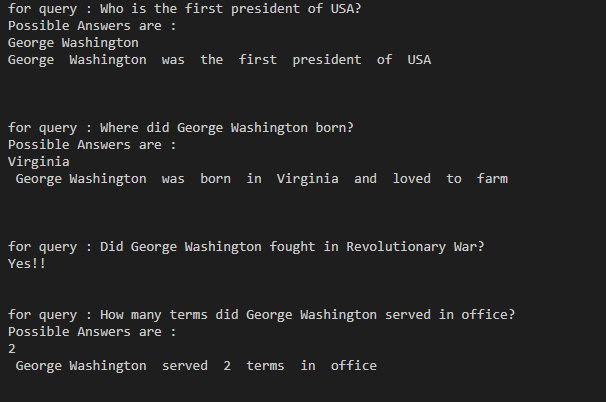
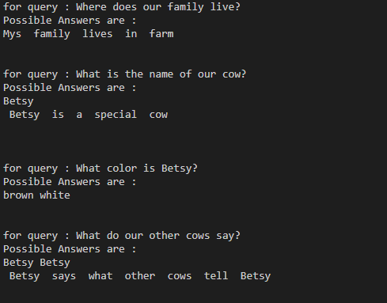

# QA_system
Basic Question Answering Model using Information Retrieval Techniques.

----
### Methodology

* Remove contractions from passage as well as queries.
`Example : isn't --> is not`

* Lemmatize statements, so it can be helpful in finding out the similiarity.

* __Pronoun Resolution__ , Used stanford nlp toolkit for pronoun resolution.
* Stanford nlp toolkit don't resolve __collective pronouns__.
* I used a technique, by using subjects in previous sentences to replace collective pronouns.
* For each query, the sentences from passage are ranked based on jaccardi similarity.
* Divide a query into 2 types:
  * __Auxiliary verb based__
  * __Entity based__
* Auxiliary based are queries starting with Can, Did you, etc.., we check the sentiment of sentence and query to check whether they match out or cancel out each other.
* If they cancel out or subject is changed, the answer is No!! else it is Yes!!

* In Entity based, we first define query's required entity, with a dictionary map we have prepared.
* Based on rank of sentences of passage, apply __Named Entity Recognition__ on sentence, we check for if there exist any entity in query which equals query's entity.
* If it is present we present it as answer else we return the high ranked sentence from passage.

----
### Results

Passage: 

`George Washington was the first president of USA. He served 2 terms in office. He was born in Virginia and loved to farm. He fought in Revolutionary War. He is also known as Father of our Country.`

Here most of the answers are right!

Let's see a failed scenario:

Passage: 

`My family lives in farm. We have a cow named Betsy. Betsy is brown with white spots. She is a special cow. She can talk! Our other cows says , "Moo". Betsy says what other cows tell her.`

* It failed to answer, first and last queries, It cannot find general subjects like -- `farm`
* It failed to retrieve phrases. like--`"Moo!"`

Note: This is just a basic question answering system, it doesn't include any deep learning techniques.And it is not as efficient as one made with deep learning techniques.
